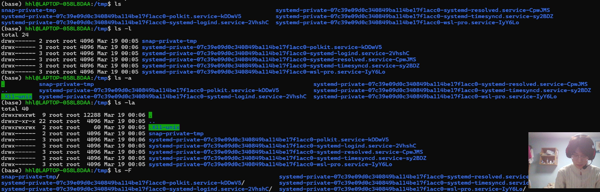
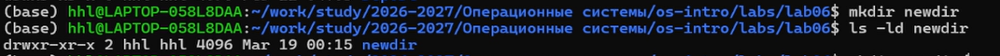
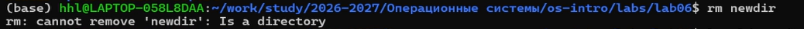
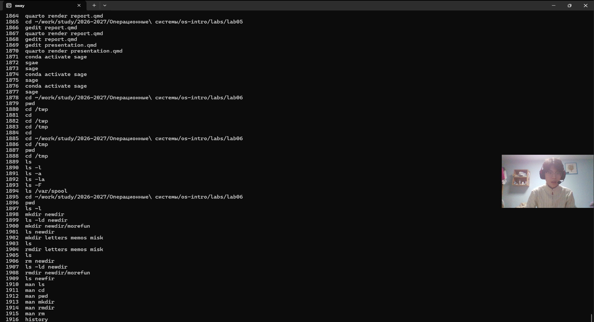

## Цель работы

- Освоение командной строки Unix  
- Работа с файлами и каталогами  
- Изучение базовых команд  

---

## Навигация по системе


```bash
pwd
cd /tmp
cd ~
```

---

## Просмотр файлов



```bash
ls
ls -l
ls -a
ls -F
```

---

## Работа с каталогами



```bash
mkdir newdir
mkdir newdir/morefun
rm -r newdir
```

---

## Ошибки и особенности



```bash
rm newdir   # ошибка
rm -r newdir  # правильно
```

---

## Дополнительные возможности

```bash
ls -R      # рекурсивно
ls -lt     # сортировка по времени
man ls     # справка
```

---

## История команд



```bash
history
!3
!3:s/a/F
```

---

## Пути и экранирование

```bash
cd /home/user/dir   # абсолютный путь
cd dir              # относительный путь

touch Мой\ файл.txt
echo "Цена \$100"
```

---

## Выводы

- Освоены базовые команды (`cd`, `pwd`, `ls`)
- Получены навыки работы с каталогами
- Изучена справочная система `man`
- Освоена история команд
- Поняты пути и экранирование

---

## Спасибо за внимание!
