## 1. Цель работы

Приобретение практических навыков взаимодействия пользователя с системой посредством командной строки.

---

## 2. Порядок выполнения работы и результаты

### 2.1 Определение полного имени домашнего каталога


```bash
pwd
```

**Результат:**  
`/home/hhl/work/study/2026-2027/Операционные системы/os-intro/labs/lab06`

---

### 2.2 Работа с каталогом /tmp

#### 2.2.1 Переход в каталог

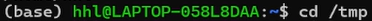

```bash
cd /tmp
pwd
```

---

#### 2.2.2 Просмотр содержимого


```bash
ls
ls -l
ls -a
ls -la
ls -F
```

**Пояснение:**

| Команда | Описание |
|--------|---------|
| ls | Список файлов |
| ls -l | Подробный список |
| ls -a | Скрытые файлы |
| ls -la | Всё + подробно |
| ls -F | Типы файлов |

---

#### 2.2.3 Проверка cron

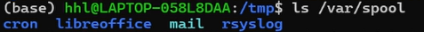

```bash
ls /var/spool
```

---

#### 2.2.4 Возврат домой

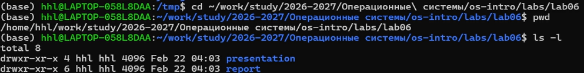

```bash
cd ~/work/study/2026-2027/Операционные\ системы/os-intro/labs/lab06
pwd
ls -l
```

---

### 2.3 Работа с каталогами

#### Создание каталогов


```bash
mkdir newdir
ls -ld newdir
```

---

#### Подкаталог

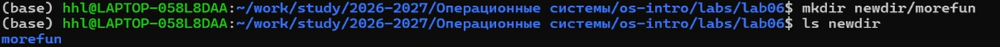

```bash
mkdir newdir/morefun
ls newdir
```

---

#### Несколько каталогов

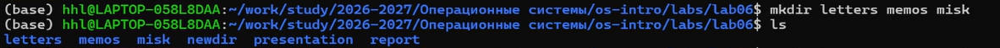

```bash
mkdir letters memos misk
ls
```

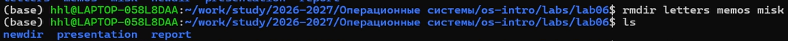

```bash
rmdir letters memos misk
ls
```

---

#### Ошибка rm


```bash
rm newdir
```

Ошибка:

```
rm: cannot remove 'newdir': Is a directory
```

---

#### Удаление подкаталога

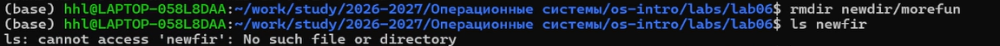

```bash
rmdir newdir/morefun
ls newdir
```

---

### 2.4 Рекурсивный вывод

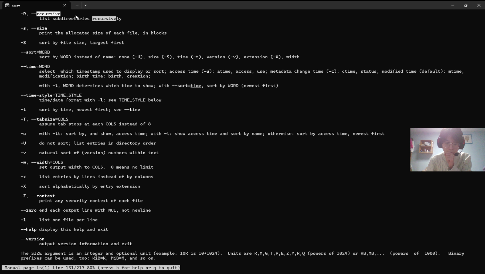

```bash
ls -R
```

---

### 2.5 Сортировка по времени

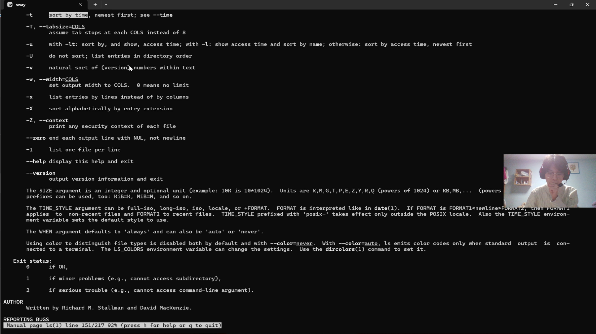

```bash
ls -lt
ls -ltr
```

---

### 2.6 Изучение команд

#### cd

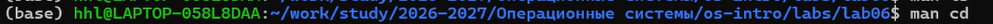

```bash
cd ~
cd ..
cd -
```

---

#### pwd

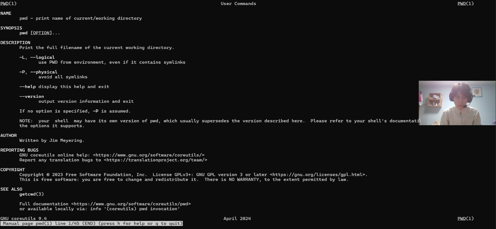

```bash
pwd -L
pwd -P
```

---

#### mkdir

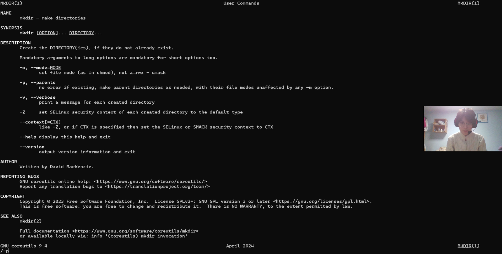

```bash
mkdir -p dir1/dir2/dir3
mkdir -m 755 dir
```

---

#### rmdir

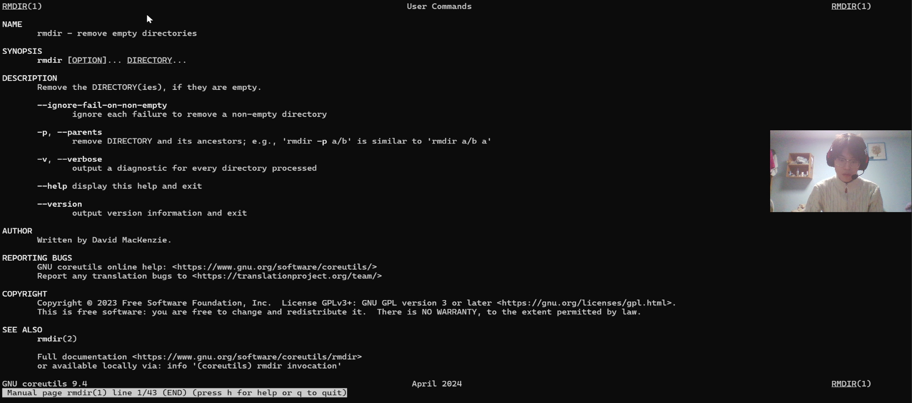

```bash
rmdir -p dir1/dir2/dir3
```

---

#### rm

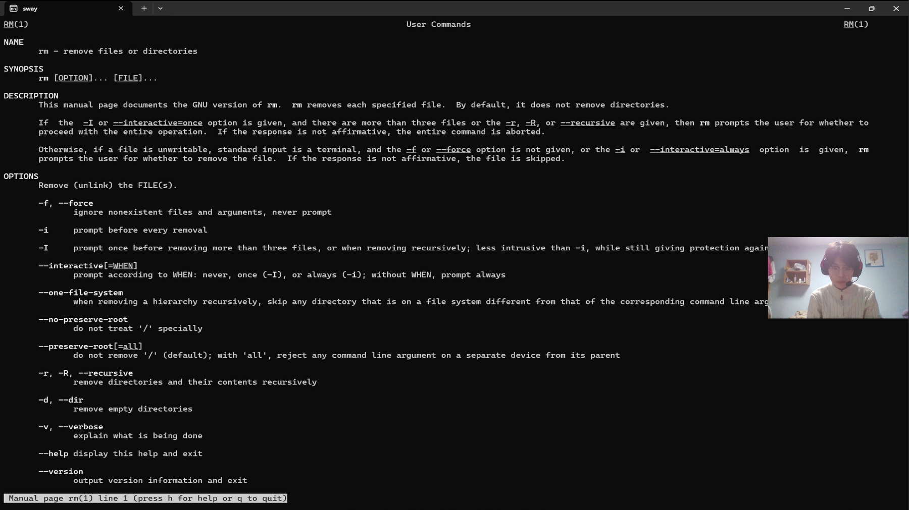

```bash
rm file.txt
rm -r dir
rm -rf dir
```

---

### 2.7 История команд


```bash
history
```

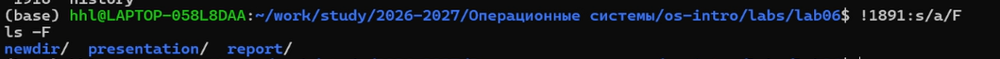

```bash
!1891
!1891:s/a/F
```

---

## 3. Ответы на вопросы

**Командная строка** — текстовый интерфейс управления системой.

**Определение пути:**
```bash
pwd
```

**Типы файлов:**
```bash
ls -F
```

**Скрытые файлы:**
```bash
ls -a
ls -la
```

**Удаление:**
```bash
rm file
rmdir dir
rm -r dir
```

**История:**
```bash
history
```

**Модификация:**
```bash
!3:s/a/F
```

**Несколько команд:**
```bash
cd /tmp; ls
mkdir dir && cd dir
cd bad || echo "error"
```

**Экранирование:**
```bash
touch Мой\ файл.txt
echo "Цена \$100"
```

**ls -l:**
Права, владелец, размер, дата, имя.

**Пути:**
```bash
cd /absolute/path
cd relative/path
```

**Справка:**
```bash
man ls
ls --help
```

**Автодополнение:** клавиша Tab

---

## 4. Выводы

- Освоены команды `cd`, `pwd`
- Изучен `ls`
- Освоены `mkdir`, `rm`, `rmdir`
- Работа с `man`
- Изучена история команд
- Освоены пути и экранирование

Все задачи выполнены.
