## 1. Цель работы

- Ознакомление с файловой системой Linux, её структурой, именами и содержимым каталогов.
- Приобретение практических навыков по применению команд для работы с файлами и каталогами.
- Изучение прав доступа и их изменения с помощью команды `chmod`.
- Получение навыков анализа файловой системы с помощью команд `mount`, `df`, `fsck`.

---

## 2. Порядок выполнения работы и результаты

### 2.1 Подготовка рабочего окружения

#### 2.1.1 Создание рабочей директории

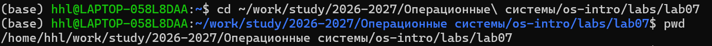

```bash
cd ~/work/study/2026-2027/Операционные\ системы/os-intro/labs/lab07
pwd
```

**Результат:** Создана и активирована рабочая директория.

---

### 2.2 Выполнение операций с файлами и каталогами

#### 2.2.1 Копирование файла

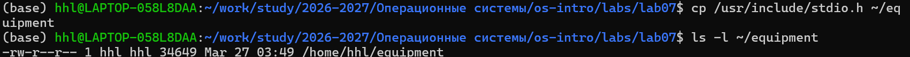

```bash
cp /usr/include/stdio.h ~/equipment
ls -l ~/equipment
```

**Результат:** Файл `stdio.h` скопирован.

---

#### 2.2.2 Создание каталога

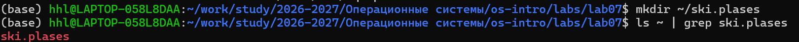

```bash
mkdir ~/ski.plases
```

**Результат:** Создан каталог `~/ski.plases`.

---

#### 2.2.3 Перемещение файла

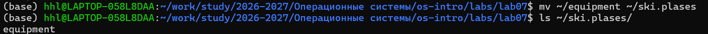

```bash
mv ~/equipment ~/ski.plases/
```

**Результат:** Файл перемещён.

---

#### 2.2.4 Переименование файла

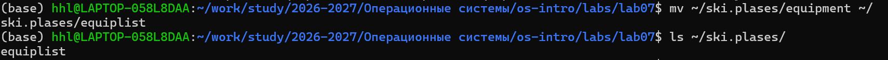

```bash
mv ~/ski.plases/equipment ~/ski.plases/equiplist
```

**Результат:** Файл переименован.

---

#### 2.2.5 Создание и копирование файла

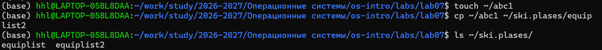

```bash
touch ~/abc1
cp ~/abc1 ~/ski.plases/equiplist2
```

---

#### 2.2.6 Создание вложенного каталога

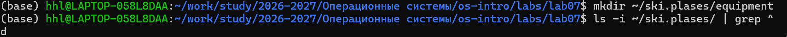

```bash
mkdir ~/ski.plases/equipment
```

---

#### 2.2.7 Перемещение нескольких файлов

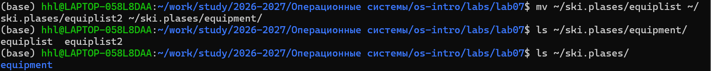

```bash
mv ~/ski.plases/equiplist ~/ski.plases/equiplist2 ~/ski.plases/equipment/
```

---

#### 2.2.8 Перемещение и переименование каталога

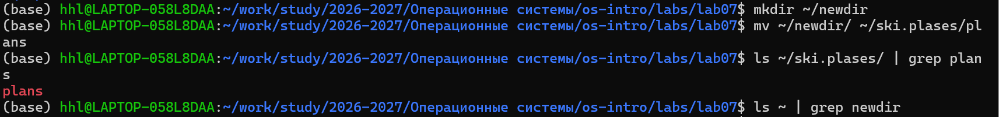

```bash
mkdir ~/newdir
mv ~/newdir ~/ski.plases/plans
```

---

### 2.3 Изменение прав доступа

#### 2.3.1 Создание тестовых файлов

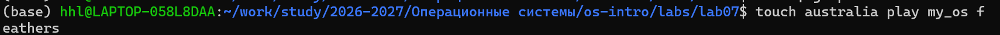

```bash
touch australia play my_os feathers
```

---

#### 2.3.2 Установка прав доступа

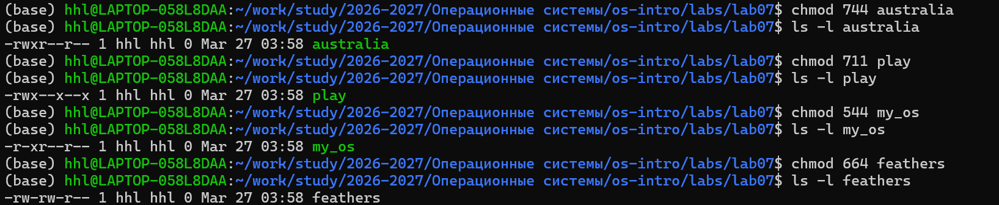

```bash
chmod 744 australia
chmod 711 play
chmod 544 my_os
chmod 664 feathers
ls -l
```

---

### 2.4 Анализ файловой системы

#### 2.4.1 Просмотр подключённых файловых систем

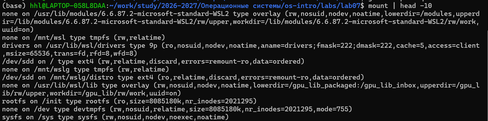

```bash
mount | head -10
```

---

#### 2.4.2 Анализ дискового пространства

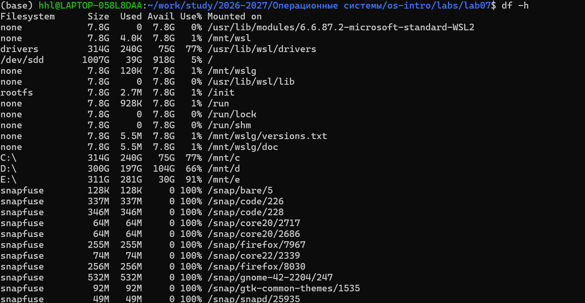

```bash
df -h
```

---

#### 2.4.3 Просмотр /etc/fstab

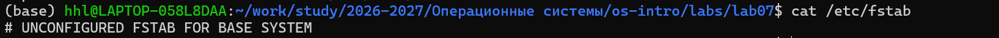

```bash
cat /etc/fstab
```

---

## 3. Ответы на вопросы

**Просмотр файлов:**
- `cat`
- `less`
- `head`
- `tail`

**Команда mv:**
- Перемещение
- Переименование
- Работа с несколькими файлами

**Права доступа:**
- `r`, `w`, `x`
- `chmod u+x file`
- `chmod 755 file`

**drwxr-x--x:**
- d — каталог  
- rwx — владелец  
- r-x — группа  
- --x — остальные  

**Файловые системы:**
- ext2/ext3/ext4  
- xfs  
- ntfs/fat  
- tmpfs  
- proc  

**df:**
- `df -h` — удобный формат  

**fsck:**
```bash
sudo fsck /dev/sda1
```

---

## 4. Выводы

- Изучена файловая система Linux  
- Освоены команды (`cp`, `mv`, `mkdir`, `touch`)  
- Изучен `chmod`  
- Освоены `mount`, `df`, `fstab`  

Все задачи выполнены.
