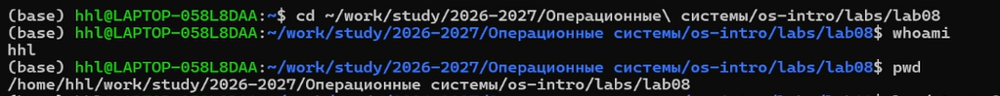
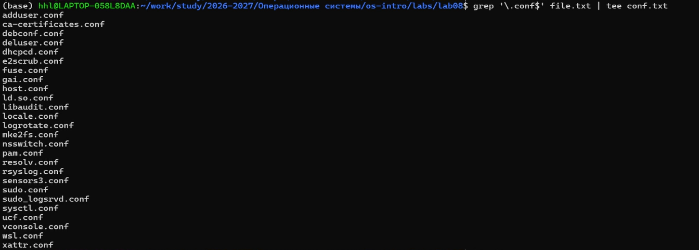
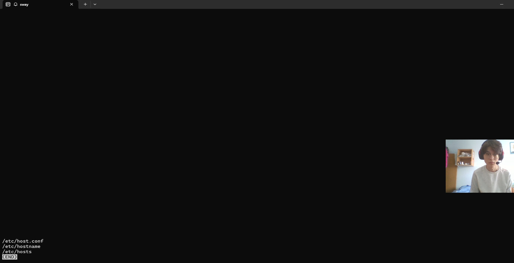
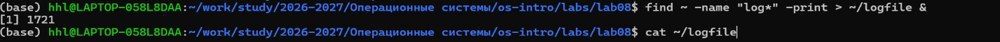
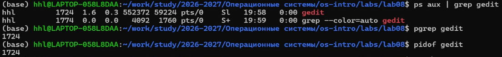
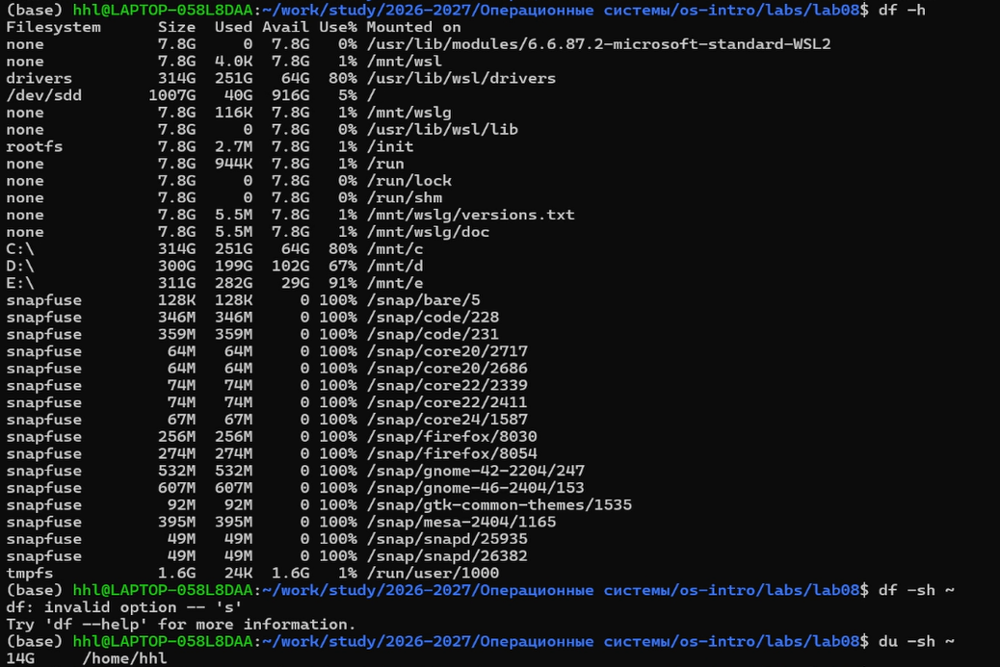

## Цель работы

- Поиск файлов и фильтрация  
- Перенаправление ввода-вывода  
- Работа с процессами  
- Анализ диска  

---

## Подготовка



```bash
whoami
pwd
cd ~/lab08
```

---

## Перенаправление вывода


```bash
ls /etc > file.txt
ls ~ >> file.txt
```

- `>` перезапись  
- `>>` добавление  

---

## Поиск файлов



```bash
grep ".conf$" file.txt
find ~ -name "*.txt"
```

- Фильтрация (`grep`)  
- Поиск (`find`)  

---

## Конвейеры

```bash
ls -la | grep ".conf"
```

- Передача вывода между командами  

---

## Просмотр данных



```bash
ls /etc/h* | less
```

- Постраничный просмотр  

---

## Фоновые процессы



```bash
find ~ -name "log*" &
jobs
```

- Запуск в фоне  
- Контроль задач  

---

## Управление процессами



```bash
ps aux | grep gedit
kill <PID>
```

- Поиск процесса  
- Завершение  

---

## Анализ диска



```bash
df -h
du -sh ~
```

- Свободное место  
- Размер каталогов  

---

## Выводы

- Освоены перенаправления (`>`, `>>`)  
- Изучены конвейеры (`|`)  
- Освоены `find` и `grep`  
- Изучено управление процессами  
- Освоены `df` и `du`  

---

## Спасибо за внимание!
