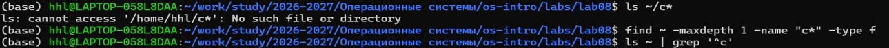
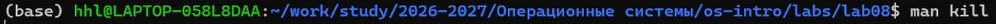

## 1. Цель работы

- Ознакомление с инструментами поиска файлов и фильтрации текстовых данных.
- Приобретение практических навыков по управлению процессами (и заданиями).
- Освоение перенаправления ввода-вывода и конвейеров.
- Получение навыков проверки использования диска (`df`, `du`, `fs quota`).

---

## 2. Порядок выполнения работы и результаты

Работа выполнялась в ОС Ubuntu. Рабочая директория:  
`/home/hhl/work/study/2026-2027/Операционные системы/os-intro/labs/lab08`

---

### 2.1 Подготовка окружения


```bash
whoami
pwd
cd /home/hhl/work/study/2026-2027/Операционные\ системы/os-intro/labs/lab08
```

**Результат:** Пользователь определён, рабочая директория установлена.

---

### 2.2 Создание файла file.txt


```bash
ls /etc > file.txt
ls ~ >> file.txt

head -n 5 file.txt
tail -n 5 file.txt
```

**Результат:** Файл содержит списки файлов.

---

### 2.3 Поиск файлов .conf


```bash
grep '\.conf$' file.txt | tee conf.txt
cat conf.txt
```

**Результат:** Найдены файлы с расширением `.conf`.

---

### 2.4 Поиск файлов на букву c



```bash
ls ~/c* 2>/dev/null
find ~ -maxdepth 1 -name "c*" -type f
ls ~ | grep '^c'
```

---

### 2.5 Постраничный вывод


```bash
ls /etc/h* | less
```

---

### 2.6 Фоновый процесс


```bash
find ~ -name "log*" -print > ~/logfile &
cat ~/logfile
```

---

### 2.7 Удаление файла


```bash
rm ~/logfile
ls -l ~/logfile
```

---

### 2.8 Запуск процесса


```bash
gedit &
```

---

### 2.9 Определение PID


```bash
ps aux | grep gedit
pgrep gedit
pidof gedit
```

---

### 2.10 Завершение процесса



```bash
man kill
kill <PID>
# kill -9 <PID>
```


```bash
ps aux | grep gedit
```

---

### 2.11 Анализ диска


```bash
df -h
du -sh ~
```

---

### 2.12 Поиск каталогов


```bash
find ~ -type d
```

---

## 3. Ответы на контрольные вопросы

### 1. Потоки ввода-вывода

- stdin (0) — стандартный ввод  
- stdout (1) — стандартный вывод  
- stderr (2) — вывод ошибок  

---

### 2. Разница между > и >>

- `>` — перезапись файла  
- `>>` — добавление в файл  

```bash
echo "text" > file.txt
echo "more" >> file.txt
```

---

### 3. Конвейер (pipe)

```bash
ls -la | grep ".conf"
```

Позволяет передавать вывод одной команды другой.

---

### 4. Процесс и программа

- Программа — файл  
- Процесс — выполняемая программа  

---

### 5. PID и GID

- PID — идентификатор процесса  
- GID — идентификатор группы  

---

### 6. Jobs

```bash
jobs
fg %1
bg %1
kill %1
```

---

### 7. top и htop

- top — просмотр процессов  
- htop — улучшенная версия  

---

### 8. Команда find

```bash
find ~ -name "*.txt"
find /var -size +10M
find . -type d -empty
```

---

### 9. Поиск по содержимому

```bash
grep -r "text" ~/
find ~ -type f -exec grep -l "pattern" {} \;
```

---

### 10. Свободное место

```bash
df -h
```

---

### 11. Размер домашнего каталога

```bash
du -sh ~
```

---

### 12. Удаление зависшего процесса

```bash
ps aux | grep name
kill <PID>
kill -9 <PID>
```

---

## 4. Выводы

- Освоено перенаправление потоков  
- Изучены конвейеры  
- Освоены `find` и `grep`  
- Изучено управление процессами  
- Освоены `df` и `du`  

Все задачи выполнены полностью.
