## Цель работы

- Освоение Midnight Commander  
- Работа с файлами и каталогами  
- Управление панелями  
- Использование встроенного редактора  

---

## Запуск mc

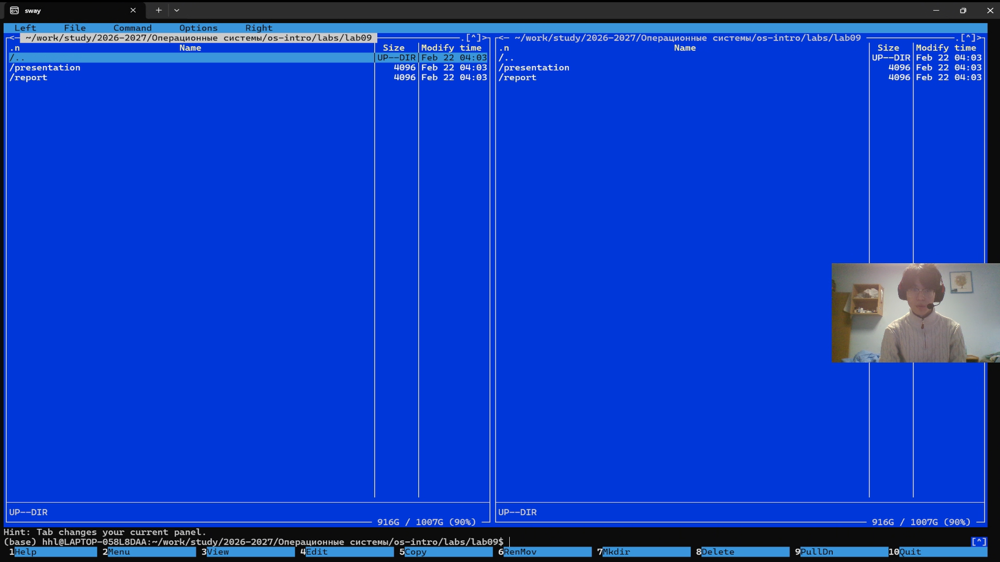

~~~bash
cd ~/lab09
mc
~~~

- Двухпанельный интерфейс  

---

## Управление панелями

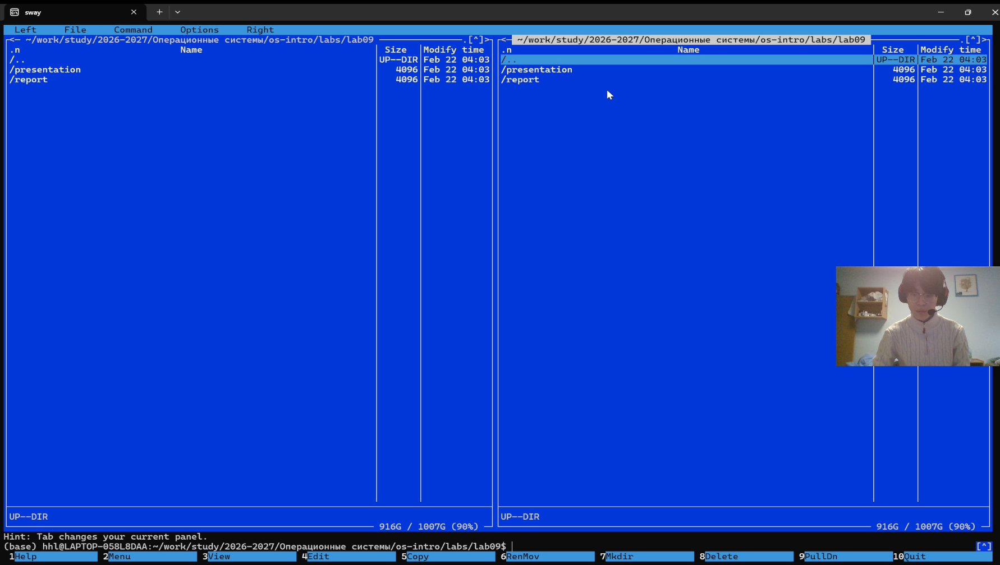

~~~bash
Ctrl + u
~~~

- Смена панелей  

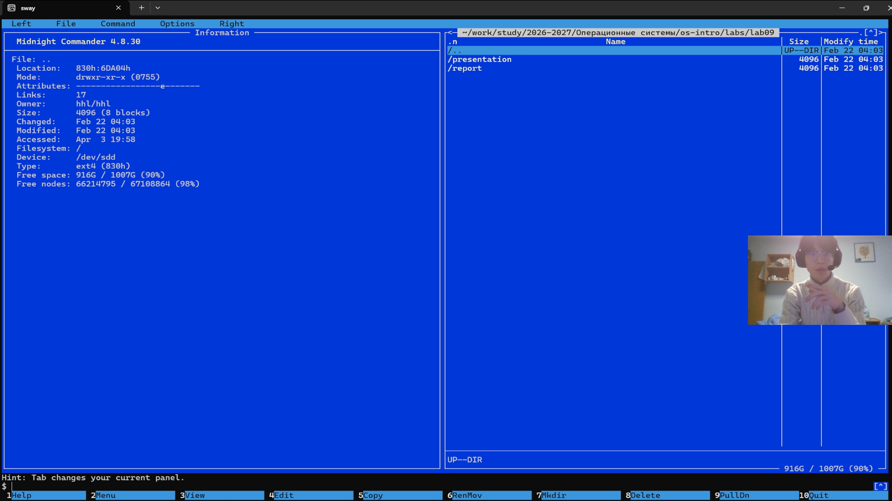

- Режим "Информация"  

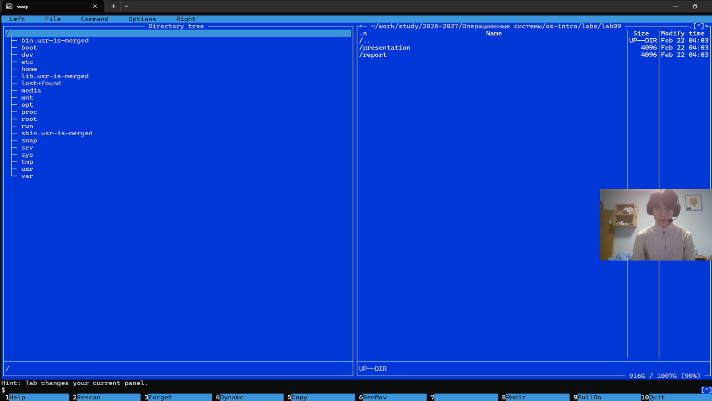

- Режим "Дерево"  

---

## Сравнение каталогов

~~~bash
Ctrl + x затем d
~~~

- Подсветка различий  

---

## Операции с файлами

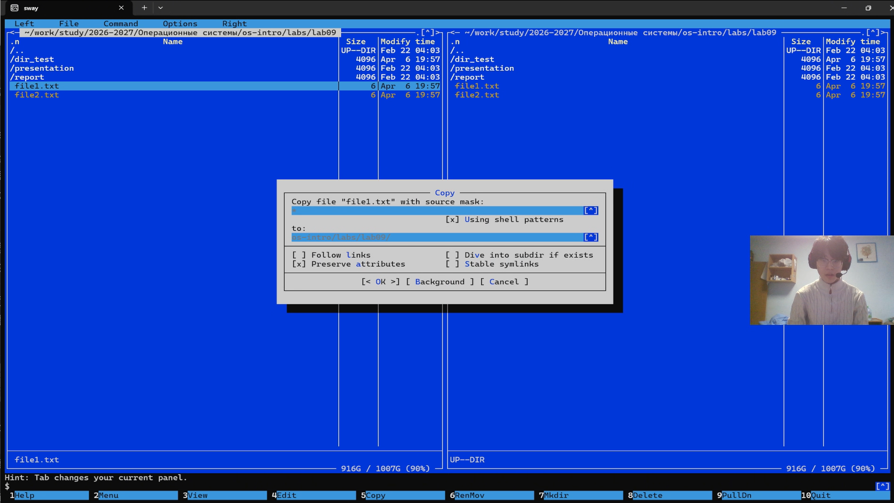

~~~bash
F5 — копирование  
F6 — переименование  
F7 — создание каталога  
F8 — удаление  
~~~

- Основные действия  

---

## Права доступа

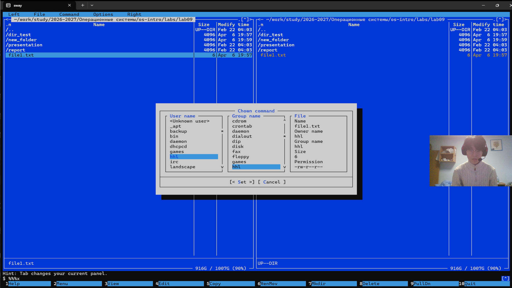

~~~bash
Ctrl + x затем c
~~~

- Изменение прав  

---

## Поиск и история

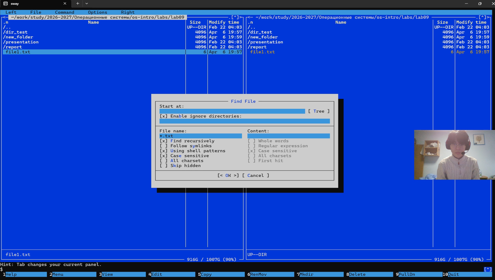

~~~bash
F9 → Команда → Поиск файла
~~~

- Поиск  

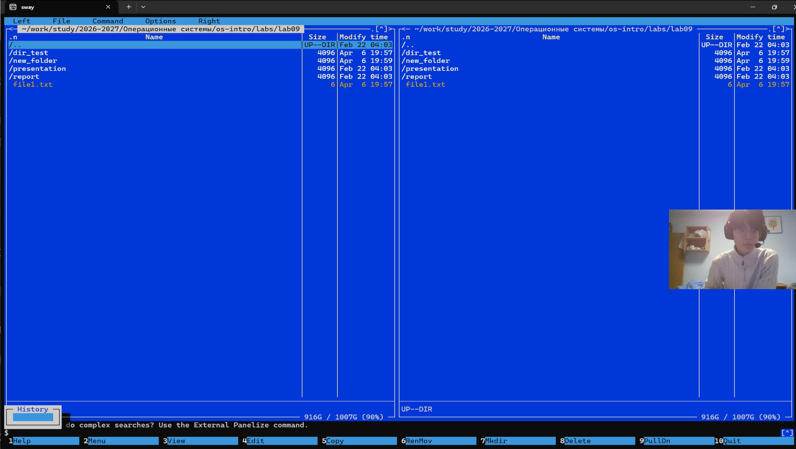

- История команд  

---

## Настройки

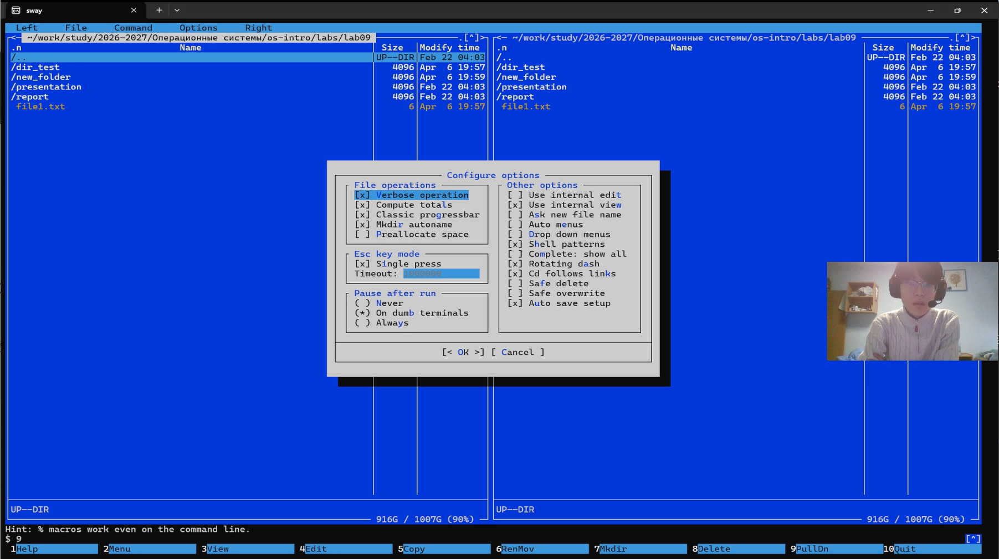

- Конфигурация интерфейса  

---

## Редактор

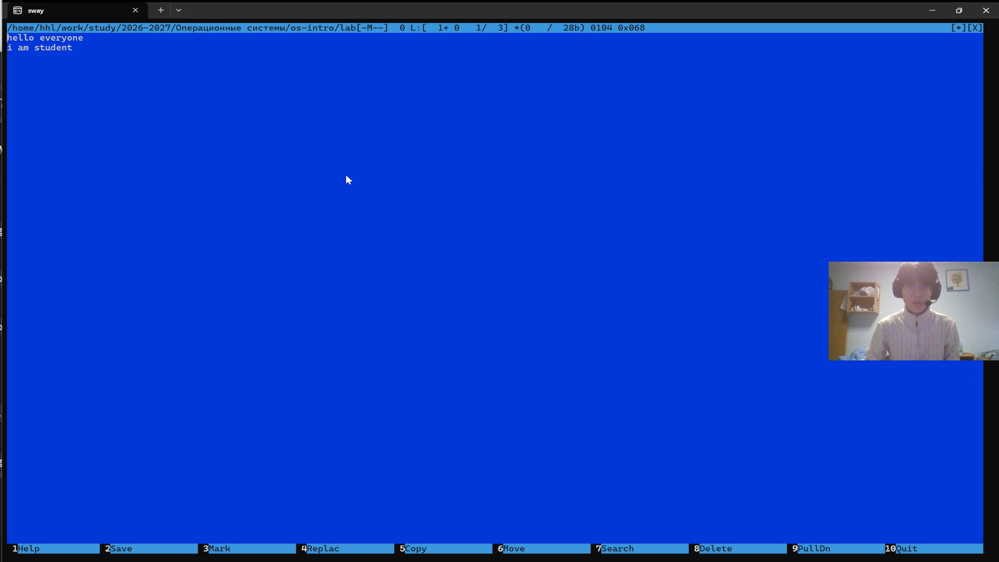

~~~bash
F4
~~~

- Открытие файла  

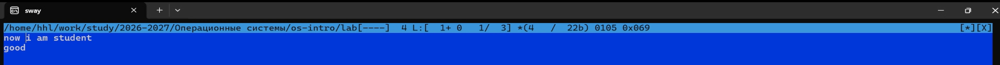

- Редактирование текста  

---

## Подсветка

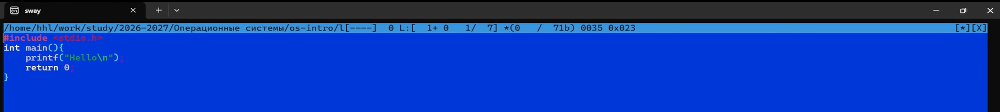

~~~c
#include <stdio.h>
~~~

- Подсветка кода  

---

## Выход

~~~bash
F10
~~~

---

## Выводы

- Освоен Midnight Commander  
- Изучены панели и режимы  
- Освоены операции с файлами  
- Изучен встроенный редактор  
