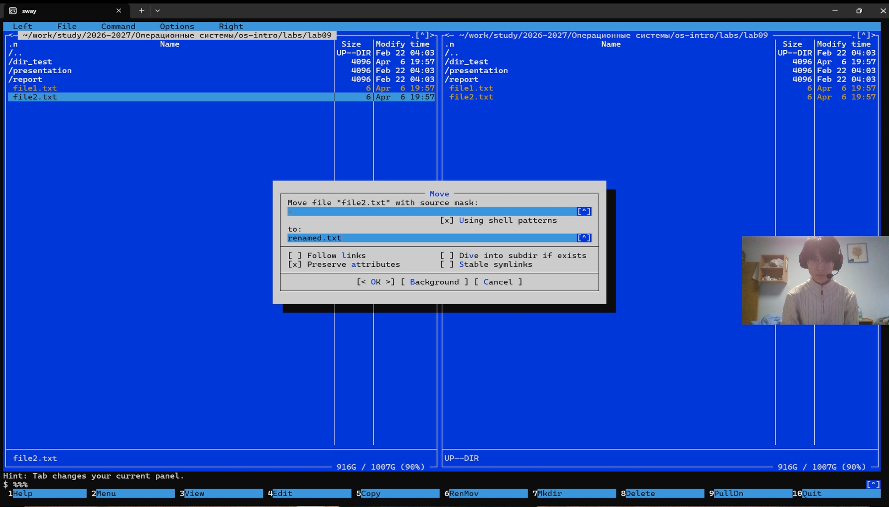
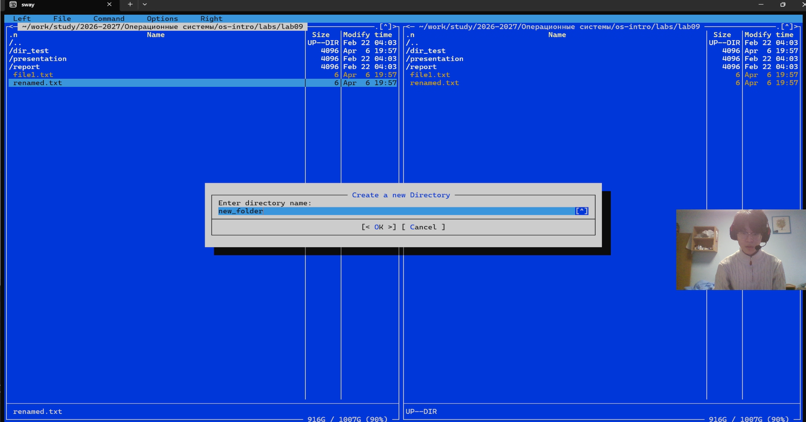
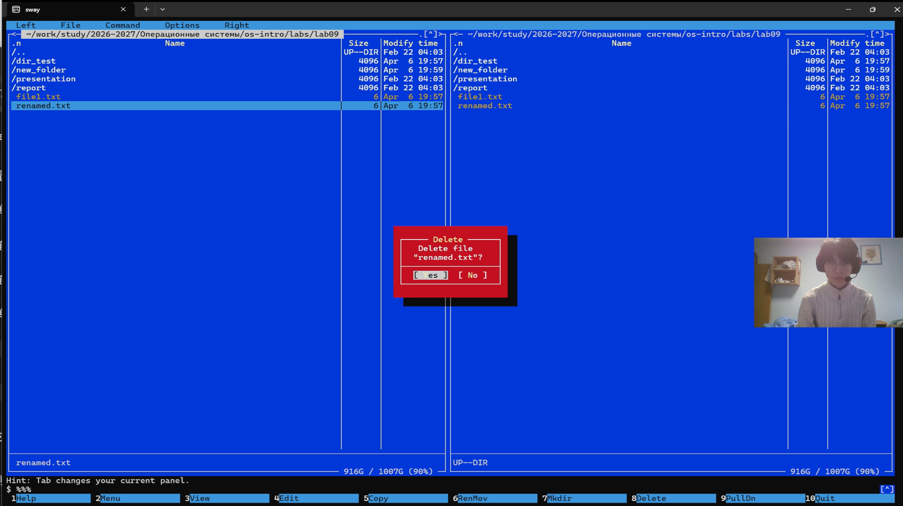

**Номер студента:** 1132254527

## 1. Цель работы

-   Освоение основных возможностей командной оболочки Midnight Commander.
-   Приобретение навыков работы с файлами и каталогами.
-   Изучение встроенного редактора mc.
-   Освоение меню и настроек mc.

## 2. Порядок выполнения работы и результаты

### 2.1 Подготовка рабочего окружения

#### 2.1.1 Запуск mc


*   **Команды:**
    ```bash
    cd "/home/hhl/work/study/2026-2027/Операционные системы/os-intro/labs/lab09"
    mc
    ```

*   **Результат:** Открыт двухпанельный интерфейс Midnight Commander.

---

### 2.2 Управление панелями

#### 2.2.1 Смена панелей


*   **Команда:**
    ```bash
    Ctrl + u
    ```

*   **Результат:** Левая и правая панели поменялись местами.

#### 2.2.2 Режим "Информация"


*   **Действие:**
    F9 → Левая панель → Информация

*   **Результат:** Отображается информация о текущем файле.

#### 2.2.3 Режим "Дерево"


*   **Действие:**
    F9 → Левая панель → Дерево

*   **Результат:** Отображается структура каталогов.

#### 2.2.4 Сравнение каталогов


*   **Команда:**
    ```bash
    Ctrl + x затем d
    ```

*   **Результат:** Различия между каталогами подсвечиваются.

---

### 2.3 Основные операции с файлами

#### 2.3.1 Копирование файла


*   **Действие:**
    F5

*   **Результат:** Файл скопирован.

#### 2.3.2 Переименование файла



*   **Действие:**
    F6

*   **Результат:** Файл переименован.

#### 2.3.3 Создание каталога



*   **Действие:**
    F7

*   **Результат:** Создан новый каталог.

#### 2.3.4 Удаление файла



*   **Действие:**
    F8

*   **Результат:** Файл удалён.

#### 2.3.5 Изменение прав доступа


*   **Команда:**
    ```bash
    Ctrl + x затем c
    ```

*   **Результат:** Открыто окно изменения прав.

---

### 2.4 Меню "Команда"

#### 2.4.1 Поиск файлов


*   **Действие:**
    F9 → Команда → Поиск файла

*   **Результат:** Открыто окно поиска.

#### 2.4.2 История команд


*   **Действие:**
    F9 → Команда → История командной строки

*   **Результат:** Отображены ранее выполненные команды.

---

### 2.5 Меню "Настройки"


*   **Действие:**
    F9 → Настройки → Конфигурация

*   **Результат:** Открыто окно настроек.

---

### 2.6 Встроенный редактор

#### 2.6.1 Создание файла


*   **Действие:**
    F4

*   **Результат:** Открыт встроенный редактор.

#### 2.6.2 Операции с текстом


*   **Действия:**
    ```text
    Ctrl + y — удалить строку
    Ctrl + x — вырезать
    Ctrl + u — вставить
    F2 — сохранить
    ```

*   **Результат:** Текст успешно отредактирован.

#### 2.6.3 Подсветка синтаксиса


*   **Пример кода:**
    ```c
    #include <stdio.h>
    int main() {
        printf("Hello, World!\n");
        return 0;
    }
    ```

*   **Результат:** Включена подсветка синтаксиса.

---

### 2.7 Выход

*   **Команда:**
    ```bash
    F10
    ```

*   **Результат:** Выход из программы.

---

## 3. Ответы на вопросы

1. Стандартный, Информация, Дерево, Быстрый просмотр.  

2. cp/F5, mv/F6, rm/F8, mkdir/F7.  

3. Панели: стандартный режим, информация, дерево.  

4. Файл: просмотр, редактирование, копирование, удаление.  

5. Команда: поиск, сравнение, история.  

6. Настройки: конфигурация, внешний вид.  

7. Ctrl+x команды: chmod, chown.  

8. Редактор: F2 сохранить, Ctrl+y удалить строку.  

9. Пользовательское меню через ~/.config/mc/menu.  

10. Файл расширений и пользовательские команды.  

---

## 4. Выводы

В ходе выполнения работы я освоил Midnight Commander, научился работать с файлами, каталогами, панелями и встроенным редактором.
