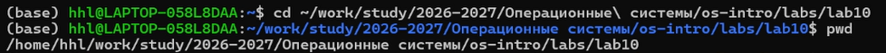
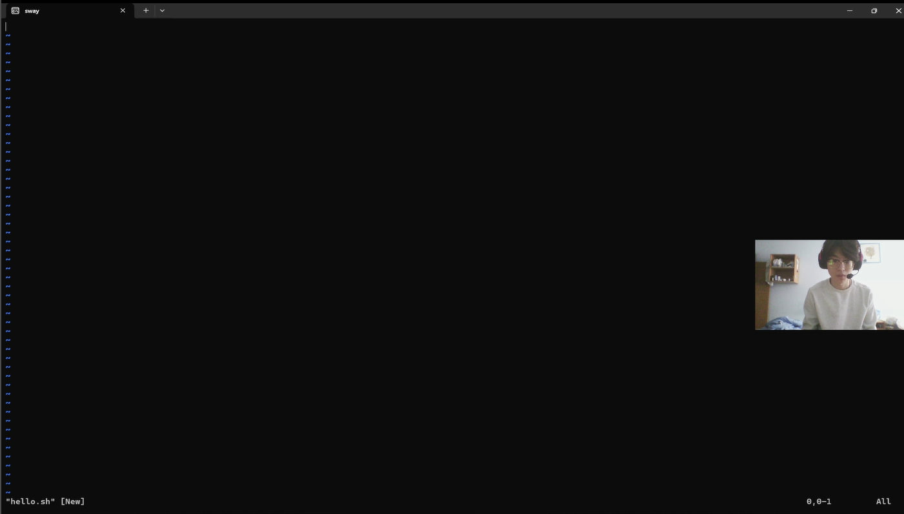
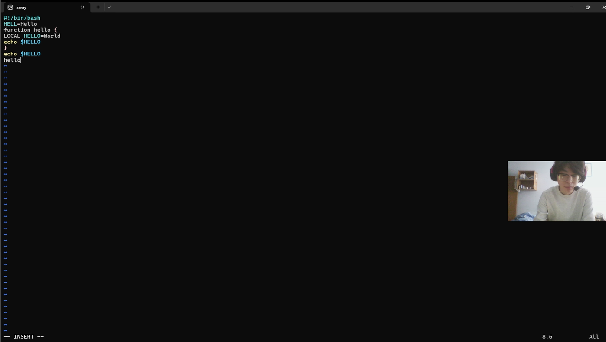
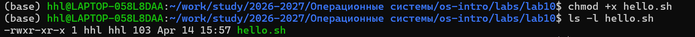
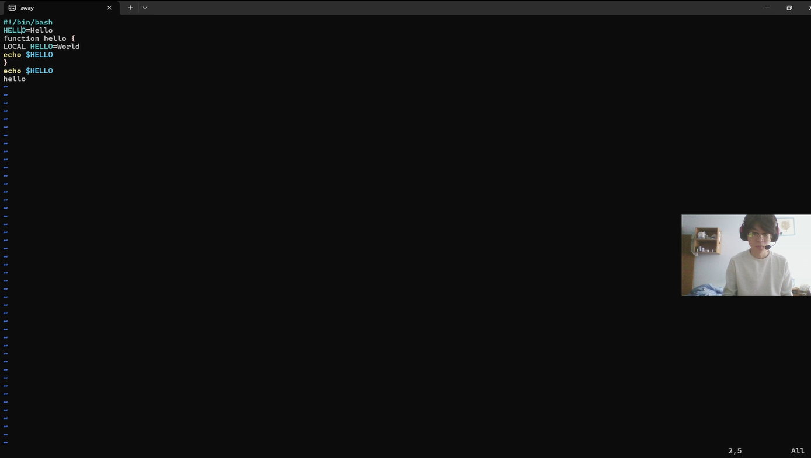
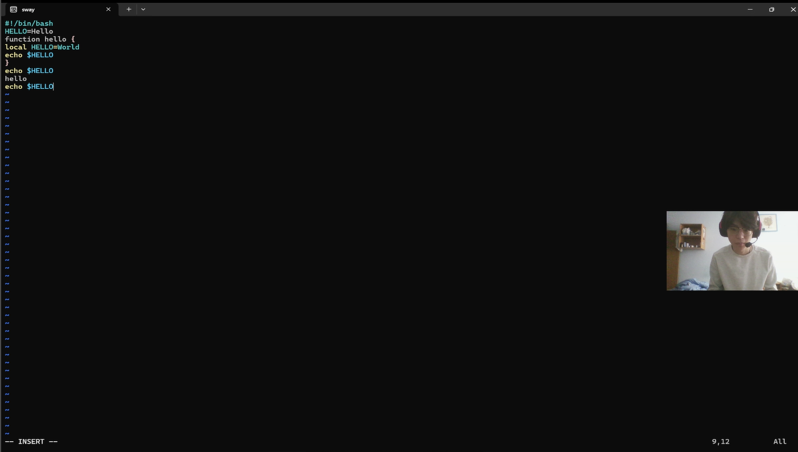
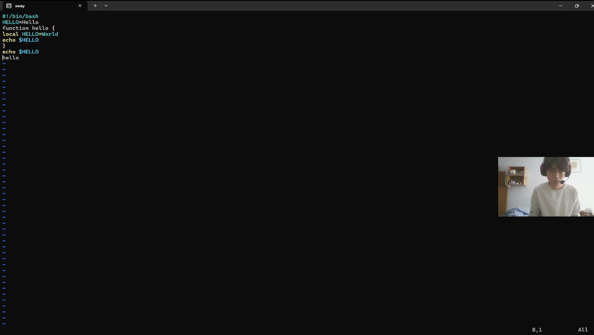
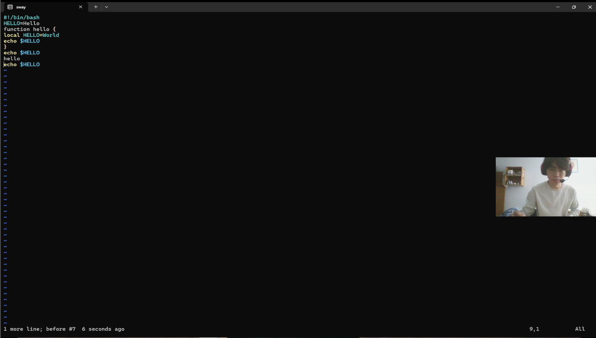
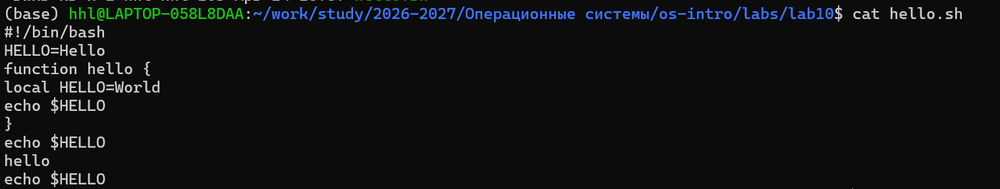
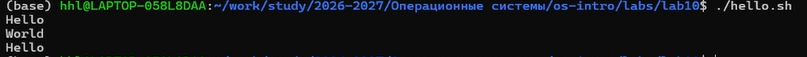

## Цель работы

- Освоение работы в Linux  
- Изучение редактора vi  
- Практика редактирования файлов  

---

## Подготовка

    cd /home/hhl/work/study/2026-2027/Операционные\ системы/os-intro/labs/lab10
    pwd

---

## Создание файла

    vi hello.sh

- Создание нового файла  

---

## Ввод текста

    #!/bin/bash
    HELL=Hello
    function hello {
    LOCAL HELLO=World
    echo $HELLO
    }
    echo $HELLO
    hello

- Режим вставки (`i`)  

---

## Сохранение и права

    chmod +x hello.sh

- Esc → :wq  

---

## Редактирование

- cw — изменение слова  

- dw + i — редактирование  

---

## Работа со строками

- G — конец файла  
- o — новая строка  

---

## Удаление и отмена

- dd — удалить  
- u — отменить  

---

## Проверка

    cat hello.sh

---

## Запуск

    ./hello.sh

- Ожидаемый вывод:
  Hello  
  World  
  Hello  

---

## Выводы

- Освоен редактор vi  
- Изучены режимы работы  
- Выполнено редактирование файла  
- Получены навыки работы в Linux  

---

## Спасибо за внимание!
