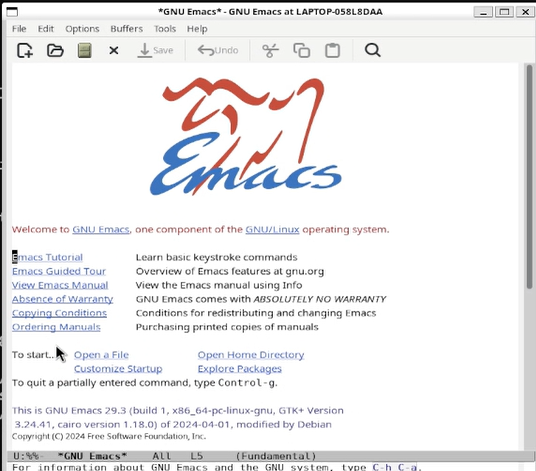
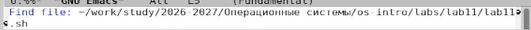
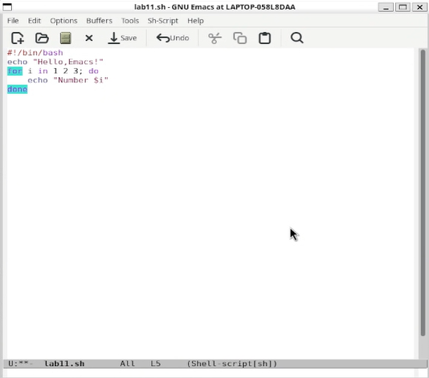
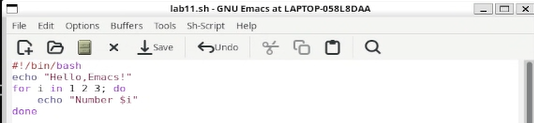
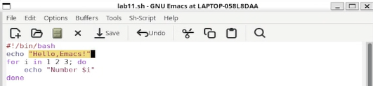
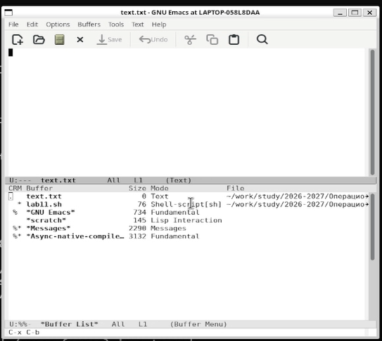
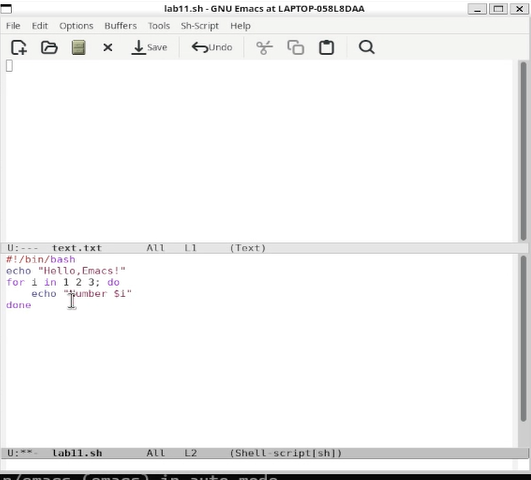
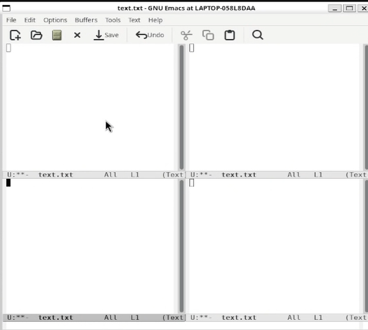
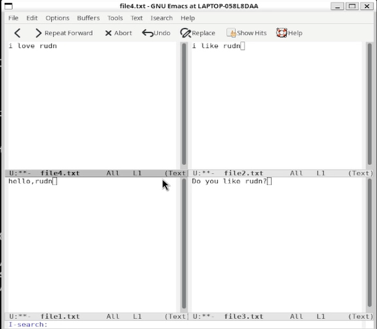

## Цель работы

- Освоение редактора Emacs  
- Работа с буферами и окнами  
- Редактирование текста  
- Поиск и замена  

---

## Установка и запуск

    sudo apt update
    sudo apt install emacs -y

    emacs &

---

## Создание файла

    C-x C-f

- Создание нового файла  

---

## Ввод текста

    #!/bin/bash
    echo "Hello, Emacs!"
    for i in 1 2 3; do
        echo "Number $i"
    done

---

## Перемещение курсора

- C-p / C-n — вверх / вниз  
- C-f / C-b — вперёд / назад  
- C-a / C-e — начало / конец строки  
- M-< / M-> — начало / конец буфера  

---

## Удаление текста

- C-d — удалить символ  
- M-d — удалить слово  
- C-k — удалить строку  

---

## Копирование и вставка

- C-space — выделение  
- C-w — вырезать  
- M-w — копировать  
- C-y — вставить  

---

## Буферы

    C-x C-b

    C-x b

---

## Окна

- C-x 2 — горизонтально  
- C-x 3 — вертикально  

---

## Поиск и замена

    C-s

    M-%

    M-s o

---

## Полезные команды

- C-x C-s — сохранить  
- C-x C-c — выход  
- C-x i — вставить файл  
- C-x C-f — открыть файл  

---

## Регулярные выражения

- \(\) — группы  
- \| — альтернатива  
- ^[0-9] — пример  

---

## Выводы

- Освоен редактор Emacs  
- Изучены буферы и окна  
- Освоены операции редактирования  
- Изучены поиск и замена  

---

## Спасибо за внимание!
